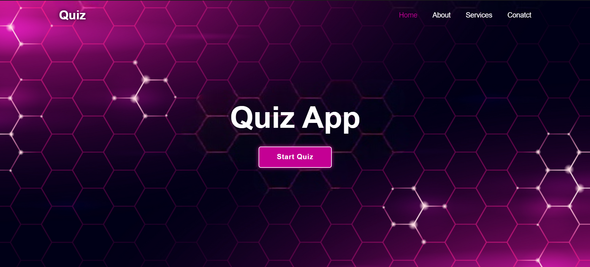

# Quiz App

A dynamic and interactive quiz application built using HTML, CSS, and JavaScript. This app allows users to test their knowledge by selecting different categories, difficulty levels, and the number of questions. It features a timer, progress bar, and displays the correct answers and scores with animations.

## Features

1. **Selection of Number of Questions:**
   - Users can choose how many questions they want to answer in a round.

2. **Selection and Display of Category and Difficulty Level:**
   - Users can select the category and difficulty level of the questions.
   - The selected category and difficulty level are displayed during the quiz.

3. **Timer for Each Question:**
   - A timer is displayed for each question.
   - When the timer has less than 6 seconds remaining, it starts blinking in red.

4. **Progress Bar:**
   - A visual progress bar fills up as the user answers each question.
   - The progress bar has a sliding animation.

5. **Current Score Display:**
   - The current score is displayed and updated as the user answers each question.

6. **Display of Correct Answer:**
   - If a user selects the wrong option, the correct answer is highlighted.

7. **End-of-Round Score Display:**
   - At the end of each round, the current score is displayed with a circular progress bar animation.

8. **High Score Display:**
   - The app keeps track of and displays the highest score achieved by the user.

## Screenshots

## Installation

1. Clone the repository:
   git clone https://github.com/yourusername/quiz-app.git
   
2. Navigate to the project directory:
  cd quiz-app

3. Open index.html in your web browser to run the app.

## Usage
  1. Select the number of questions, category, and difficulty level.
  2. Click "Start" to begin the quiz.
  3. Answer each question before the timer runs out.
  4. View your score at the end of the round.
  5. Try to beat your high score in subsequent rounds.

## Happy quizzing!
